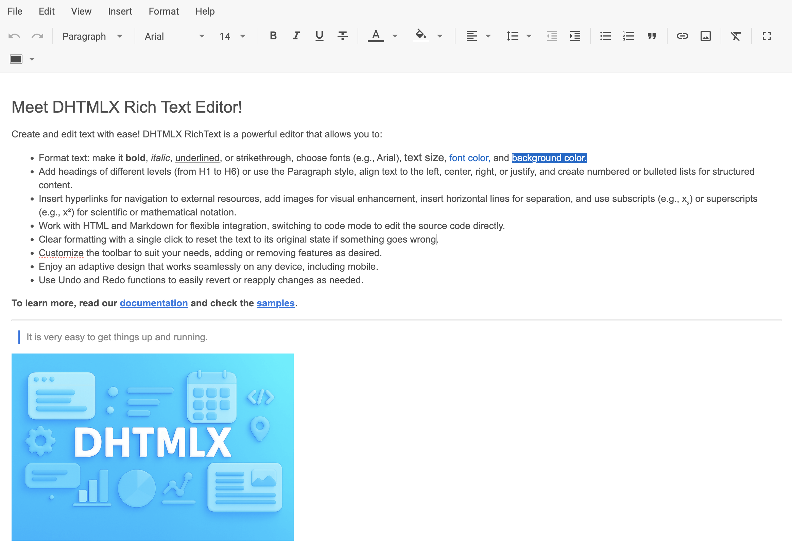

# DHTMLX Richtext with React Demo

[](https://dhtmlx.com/)



## How to start

### Online

[](https://codespaces.new/DHTMLX/react-richtext-demo)

### On the local host

Clone the repository or download files.

```
yarn
yarn start
```

or

```
npm install
npm run start
```

## Useful links

- [More demos about the DHTMLX Richtext functionality](https://snippet.dhtmlx.com/a21ea4jb?tag=richtext&mode=wide)
- [Technical support ](https://forum.dhtmlx.com/c/richtext)
- [Online  documentation](https://docs.dhtmlx.com/richtext/)

## Follow us

- Star our GitHub repo :star:
- Watch our tutorials on [YouTube](https://www.youtube.com/user/dhtmlx/videos) :eyes:
- Read us on [Medium](https://dhtmlx.medium.com) :newspaper:
- Follow us on [Twitter](https://twitter.com/dhtmlx) :feet:
- Like our page on [Facebook](https://www.facebook.com/dhtmlx/) :thumbsup:
